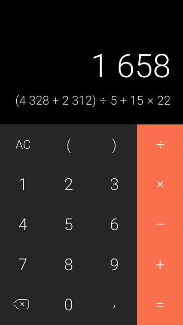

# mobile-test-droid-calculator
# Задача
Написать мобильное приложение, которое умеет вычислять значение выражений. Здорово, если приложение будет написано на Kotlin с использованием MVVM подхода. Решенное задание выложить на github/gitlab, код в архиве приниматься не будет. Все непонятные и спорные моменты остаются на ваше усмотрение.

# Описание
Макет находится по ссылке:
https://www.figma.com/file/ezZDHqkfT9BafUhzW3y9rc6i/Calc-android?node-id=0%3A1

С помощью экранных кнопок пользователь может составить математическое выражение, после нажатия на знак '=' выводится решение выражения или сообщение об ошибке. После этого нажатие на любой символ калькулятора затирает поля ответа и выражения, а затем добавляет этот символ в поле выражения. 

По-умолчанию калькулятор должен поддерживать следующие операции: сложение, вычитание, унарный минус, умножение, деление, операции в скобках. При этом калькулятор должен быть написан так, чтобы добавление более сложных операций не составило труда.